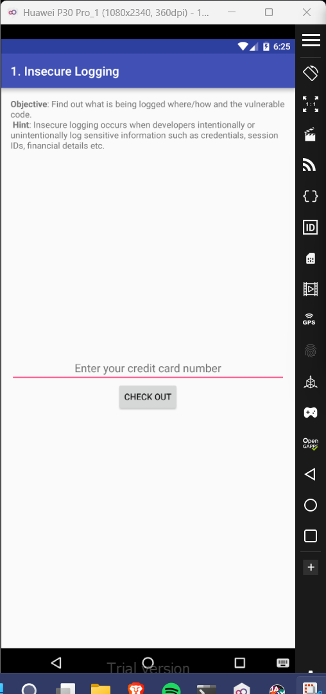
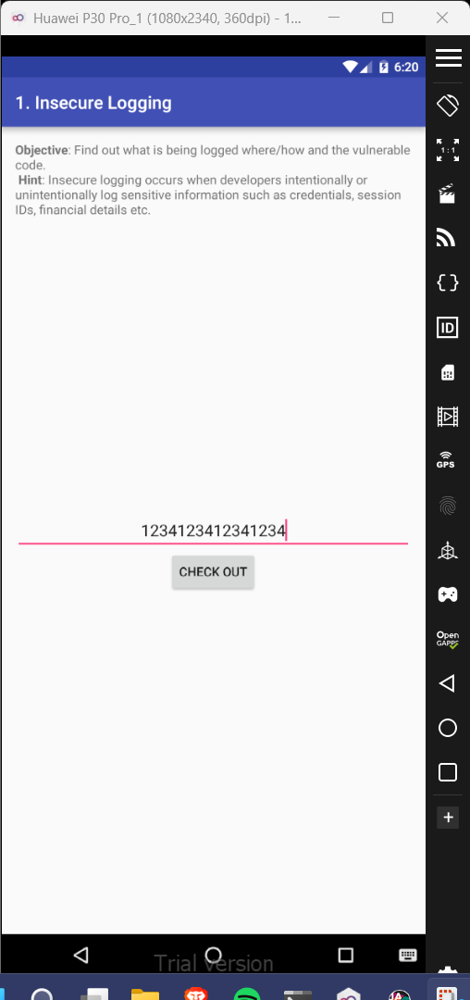
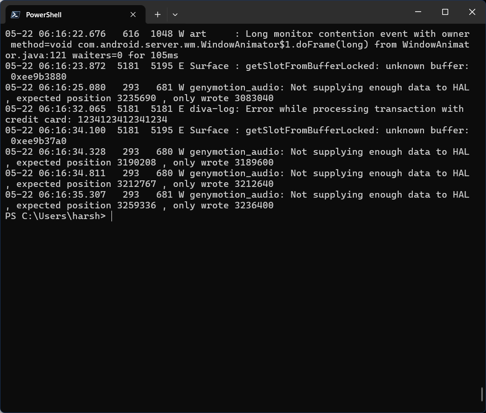

# 1. Insecure Logging

### Step 1: In a powershell window, open the Android shell using 'adb shell' command. 
### Step 2: Then use the 'logcat' command to starting printing the log of each activity occurring into the terminal window. 
### Step 3: Enter a fake credit card number into the input tab in the DIVA app, and press submit. 

### Step 4: Check the log activity in the powershell window and notice that the credit card number has been shown in clear text.

