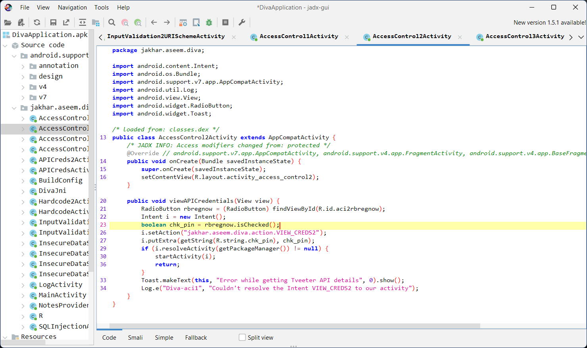

# 10. Access Control Issues - Part 2

### Step 1: If we view the code of this activity, we'll notice that the system doesn't really check to see if your account really exists, and simply gives the result if the right option is chosen. It's vulnerable here. 

### Step 2: Go back to the app, and click on the 'Already Registered' radio button, then view the API credentails of Tveeter account. 

