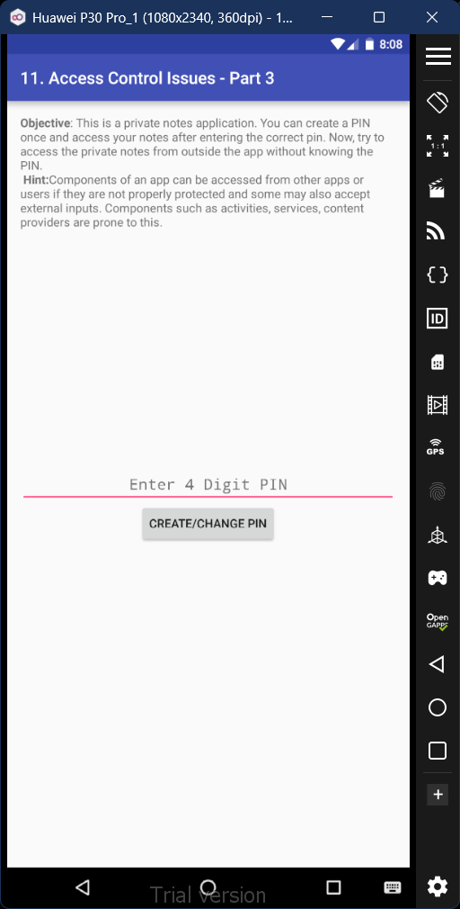
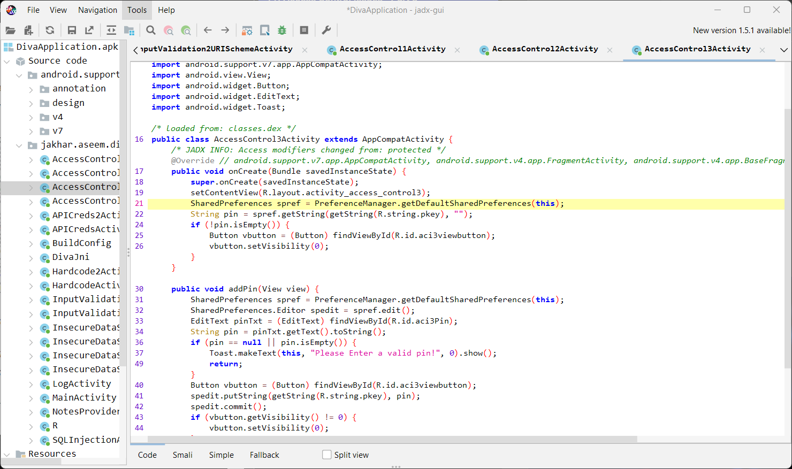
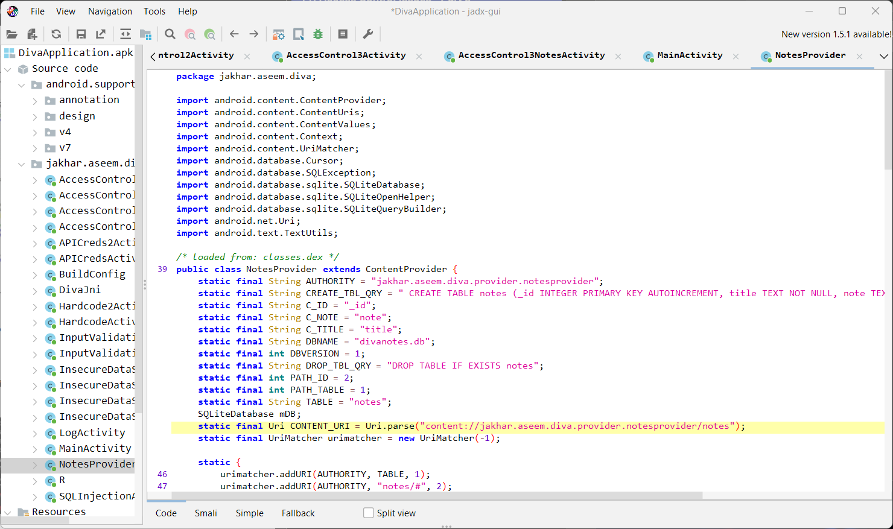
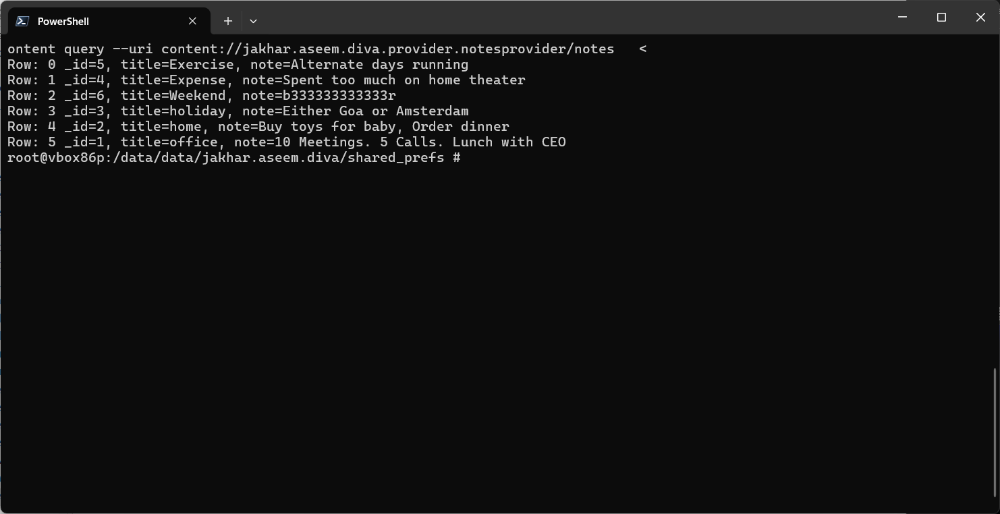

# 11. Access Control Issues - Part 3

### Step 1: Upon viewing the underlying code, we find the location of the pin. You could go to this folder and then read the appropriate file in it to gain access to the PIN. 

### Step 2: However, there's another way you could directly read the notes. Inside the jadx-gui, amongst the code files of the app, there's a code file called NotesProvider. Inside this code file, you'll find the direct file location where the notes are being stored.

### Step 3: You can view the notes by opening the root shell and then entering the command 'content query --uri content://jakhar.aseem.provider.notesprovider/notes'. And then the output on the terminal will contain the stored notes. 

