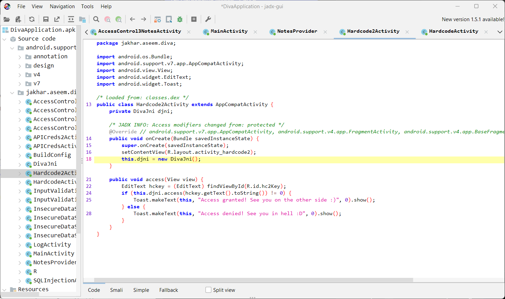
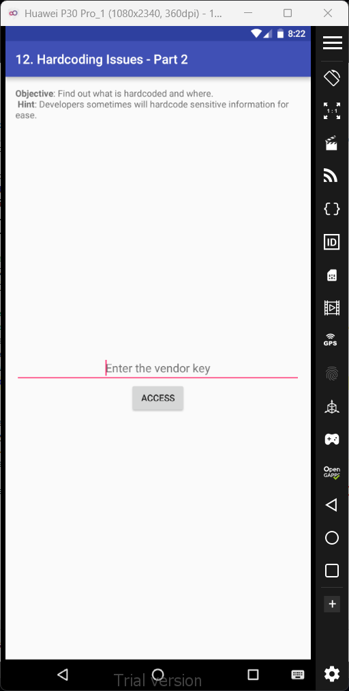
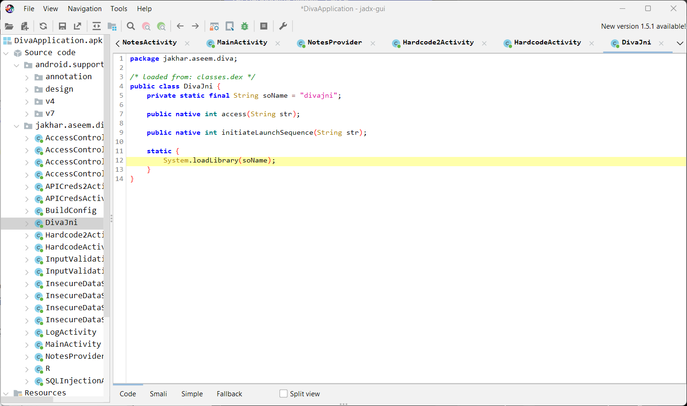
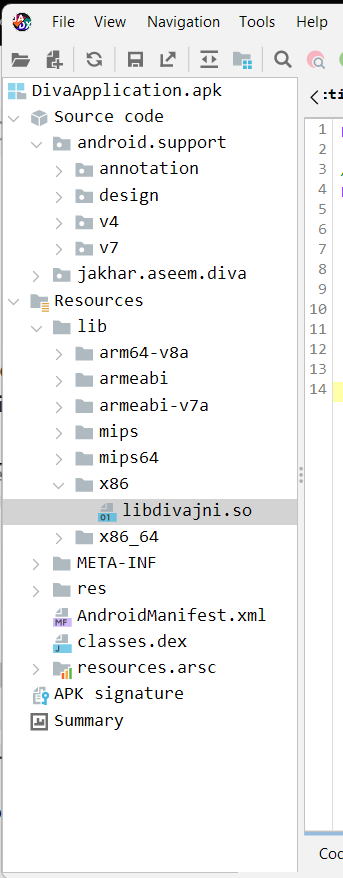
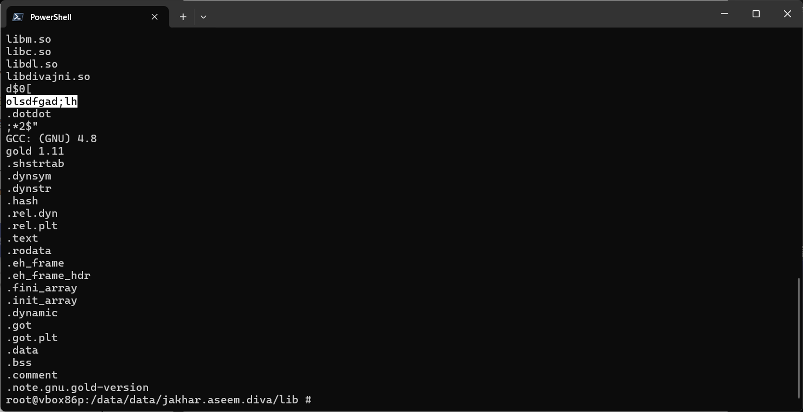
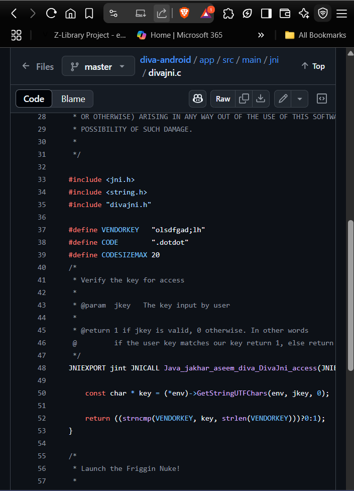
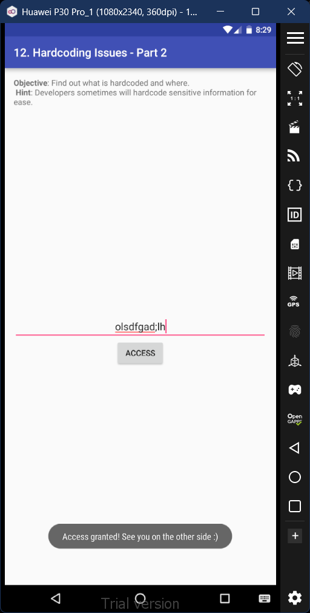

# 12. Hardcoding Issues - Part 2

### Step 1: From the main source code of this activity we find out that it creates a DivaJni source code. Then in the list of source code files there's another file called DivaJni. 

### Step 2: Inside the DivaJni code file, we see it uses a soName located in the system library.

### Step 3: To locate the soName file named 'divaJni', we navigate to this path in the jadx-gui: Resources > lib > x86 > libdivajni.so. 

### Step 4: Now to view this file in the system, we open the root shell and then navigate to the file location using the command input 'cd /data/data/jakhar.aseem.diva/lib'. Then we use 'strings libdivajni.so' command to view the contents of the file which contains various vendor keys. 

### Step  5: We have several vendor keys now, but to pinpoint the right we shall try to check the main source code the Diva project through their GitHub repository. Inside the repo, navigate to the divajni file: diva-android > app > src > main > jni > divajni.c. Inside this file, we'll see a hardcoded VENDORKEY. It matches with one of the vendor keys we obtained in the terminal list. 

### Step 6: Enter the right vendor key in the app activity, and you'll see 'Accesss granted!' prompt. 

