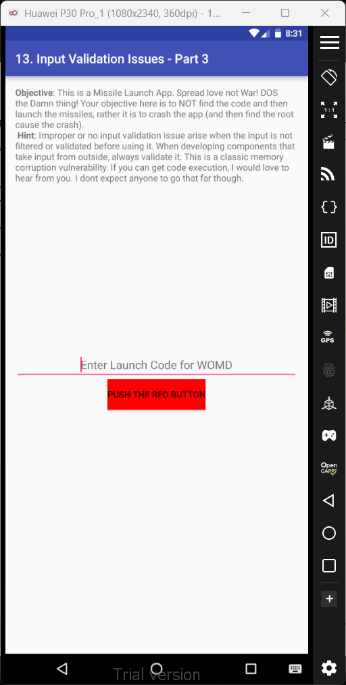
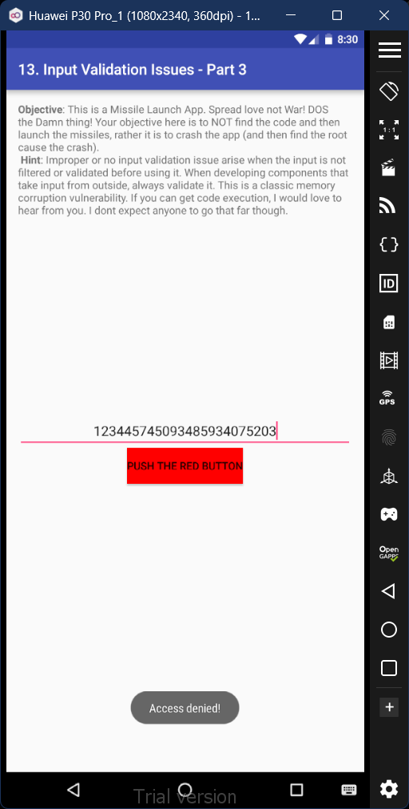
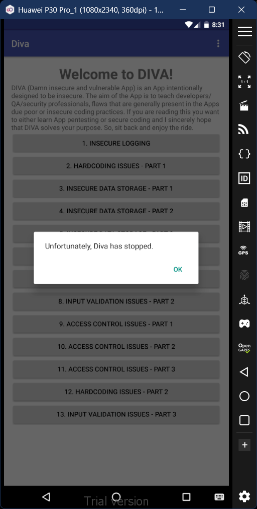

# 13. Input Validation Issues - Part 3

### Step 1: In this activity, we're required to shut down the app instead of finding the right code. So we'll attempt to overload the system with a ridiculously long number. However, it doesn't work and simply says 'Access denied!'

### Step 2: Since the previous length wasn't enough to overload, we'll attempt an even longer number. And as a result, the system does indeed crash and close. 

