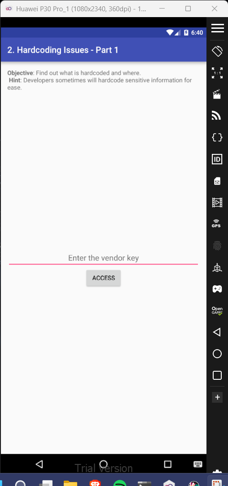
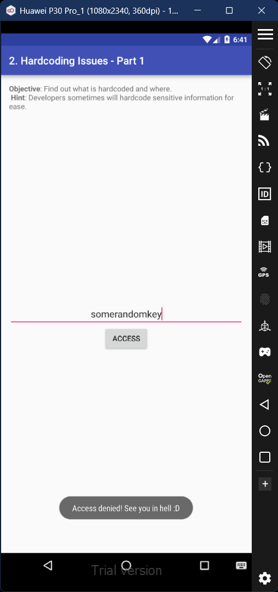
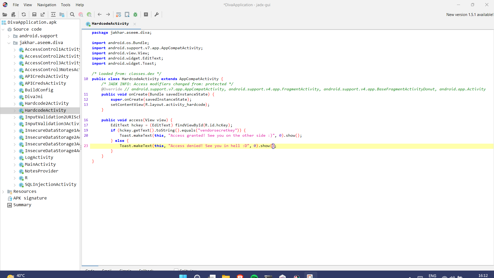
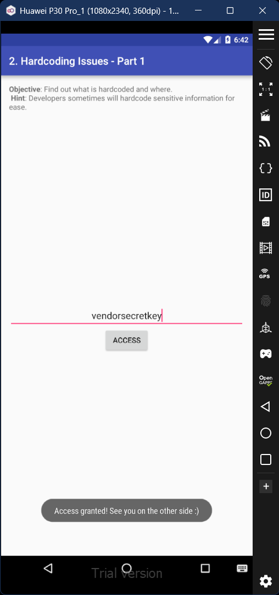

# 2. Hardcoding Issues - Part 1

### Step 1: When we try inputting a random key value, we get the 'Access Denied' prompt.

### Step 2: Open Jadx-gui to view the code of this activity. We'll notice that the correct key value has been hardcoded into the code. 

### Step 4: Input the secret key obtained from the code, and you'll get the prompt 'Access Granted'. 

