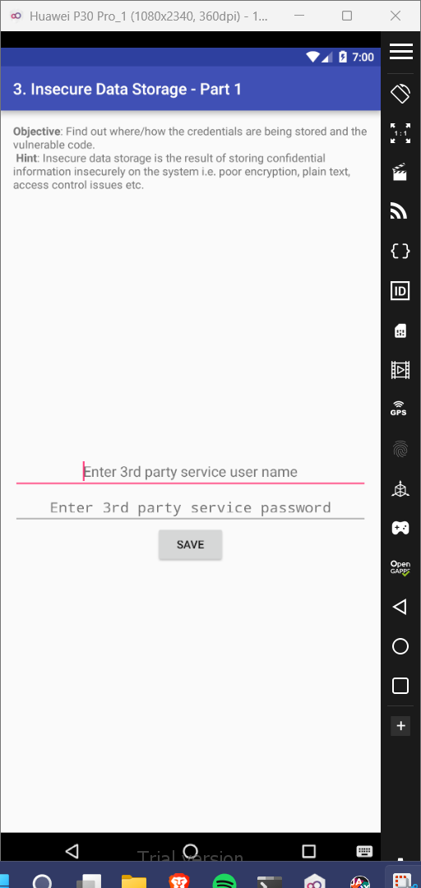
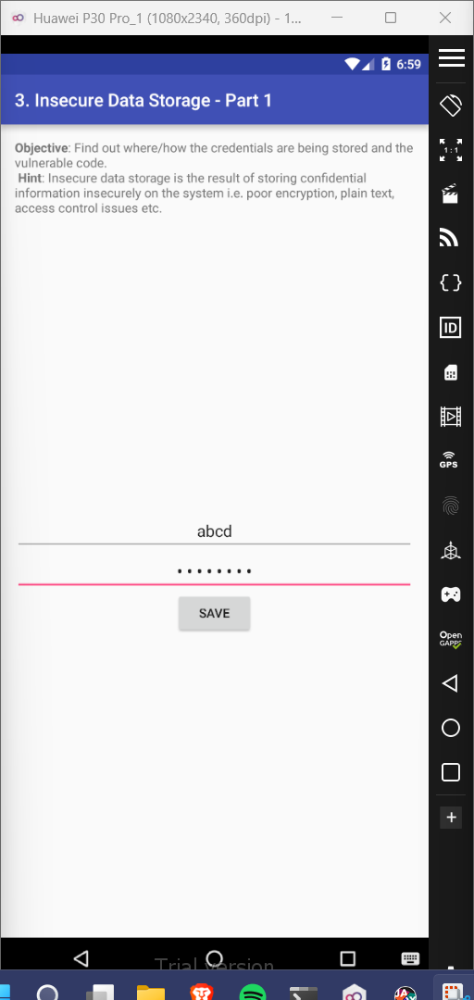
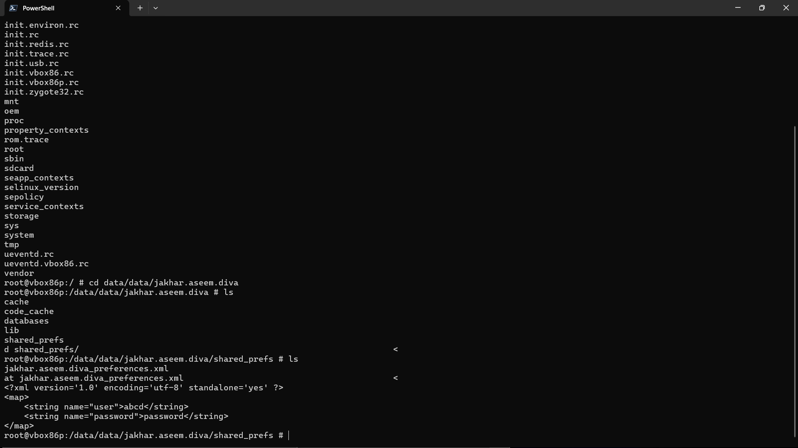

# 3. Insecure Data Storage - Part 1

### Step 1: Enter an input into the username and password fields. 

### Step 2: Go to the powershell window and use it to access the android shell. Through the shell enter the file path '/data/data/jakhar.aseem.diva/shared_prefs' and view the contents of the file 'jakhar.aseem.diva_preferences.xml'. You'll see that your previously inputted username & password in the app, are visible in clear text. 

