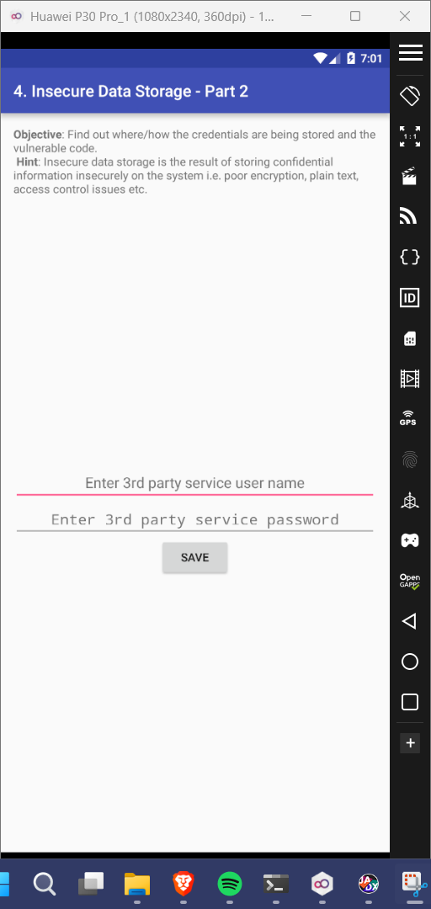
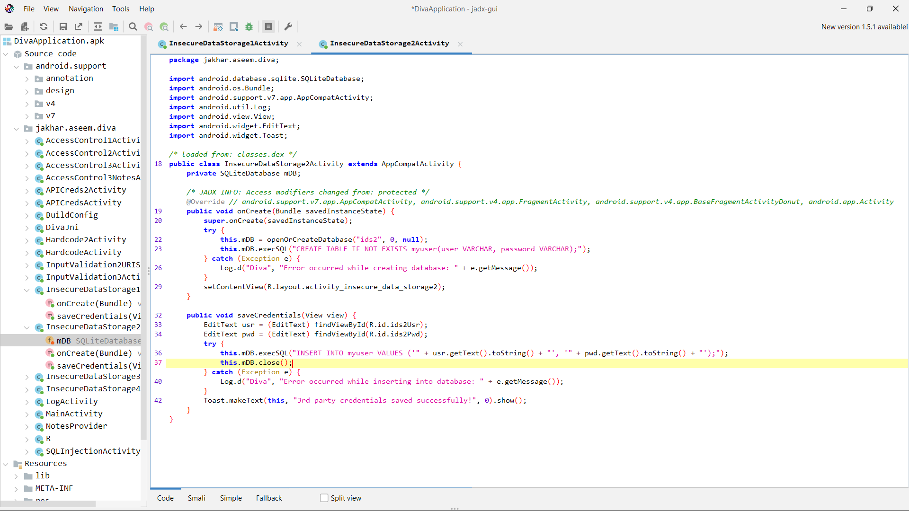
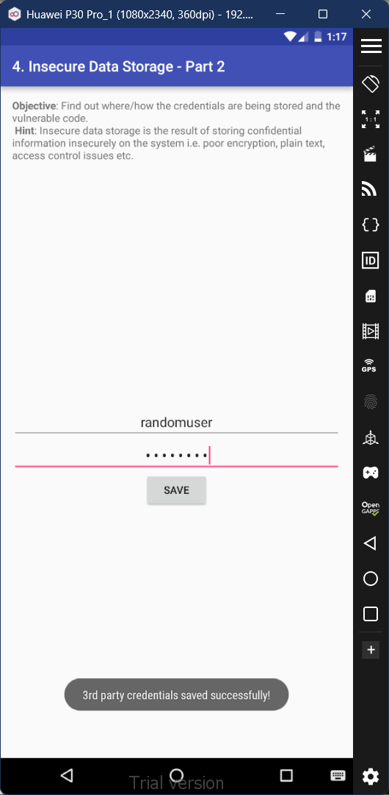
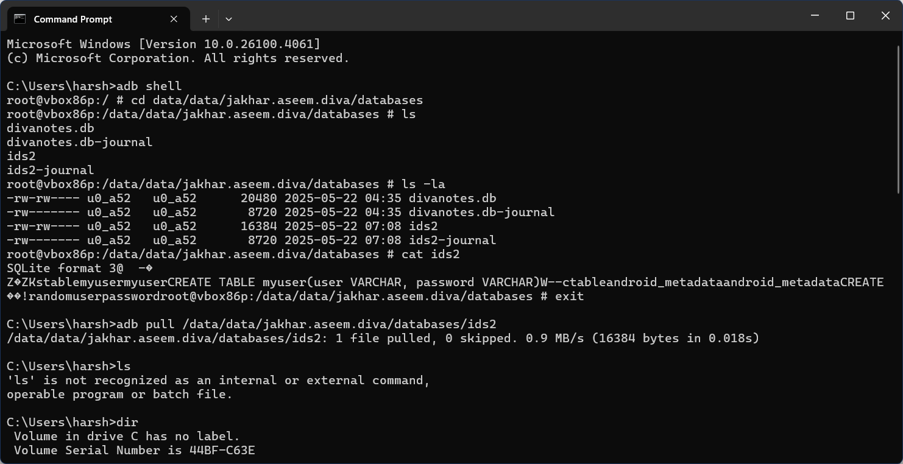
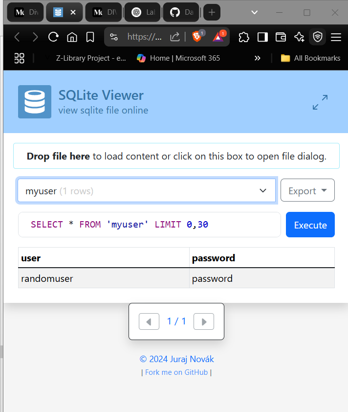

# 4. Insecure Data Storage - Part 2

### Step 1: If we view the code of this activity in jadx-gui, you'll notice that the we can see the database file that's beign created to store the inputted usernames and password. 

### Step 2: Input any username and password into the provided fields in the app and submit. 

### Step 3: Open the root shell through powershell, and browse through the directories to find the 'ids2' file. Remember the path and pull the file from the device emulator to the current device's storage using the command 'adb pull /data/data/jakhar.aseem.diva/databases/ids2'. 

### Step 4: Drag and drop the file SQLite Viewer (found onling). Then select the command to view the contents of 'myuser' and execute the presented command. You'll be able to the view your previously inputted username and password in the result. 

