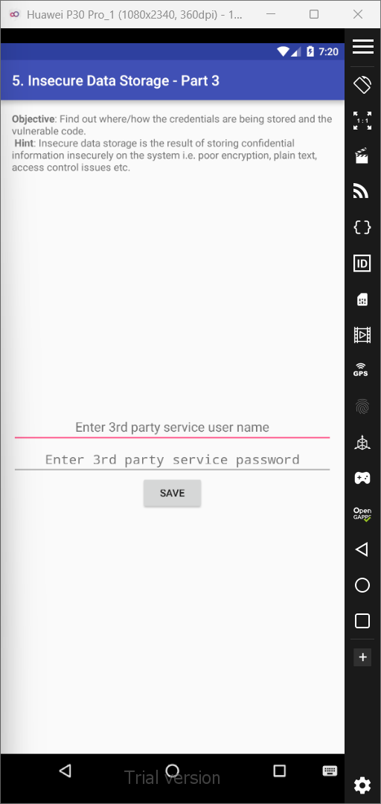
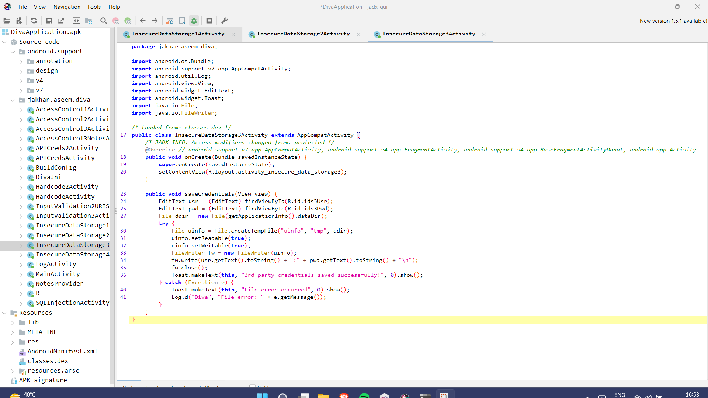
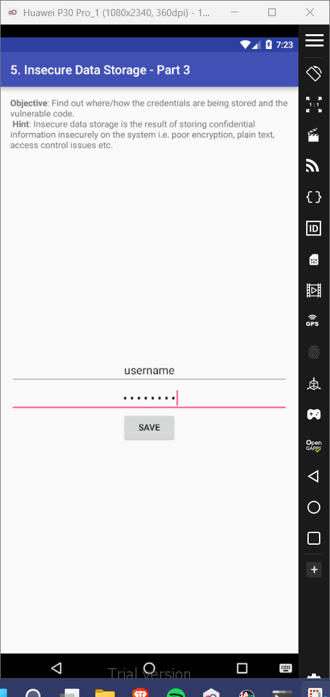
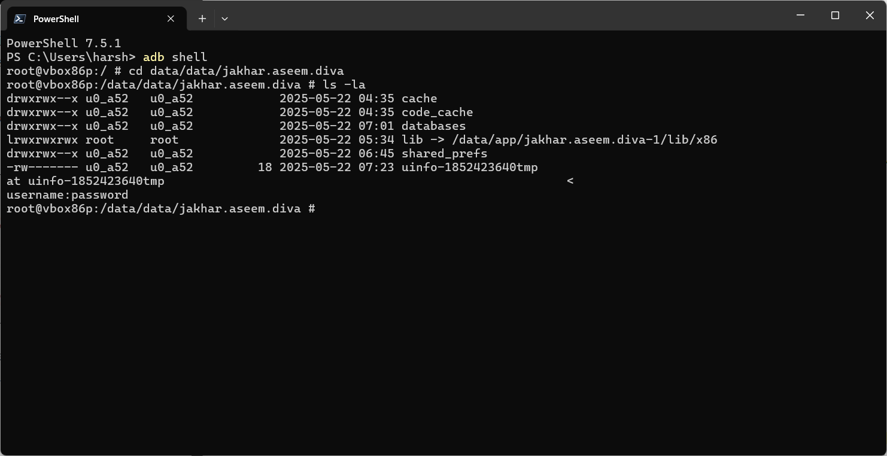

# 5. Insecure Data Storage - Part 3

### Step 1: If we view the java code for this activity in jadx-gui, we'll notice that the data entries in the app are stored in the file 'uinfo'. 

### Step 2: Enter a username and password in the app and press Save. 

### Step 3: enter the root shell, and then navigate to the location of the file using 'cd /data/data/jakhar.aseem.diva'. Inside this directory you'll find the 'uinfo' file. View the contents of this file, and you'll see the contents of the file contains your inputted username and password in cleartext.

