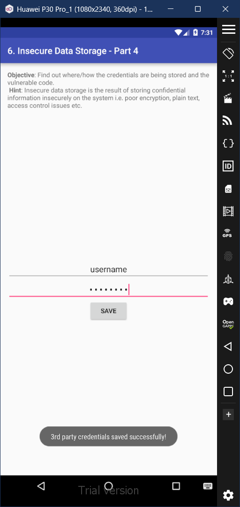

# 6. Insecure Data Storage - Part 4

### Step 1: Upon viewing the content of the code file of this section, we notice that the inputted credentials are saved in the file '/.uinfo.txt'. 

### Step 2: In the app, it's observed that when we trying to save the credentials, it says 'File error occurred'. This occurs due to the Diva app not having the permissions to access the storage. 

### Step 3: Go to Settings > Apps > Diva > Permisions, and then give it permission to access the storage. 

### Step 4: After this again reattempt to save the inputted credentials. Notice that this time its successful.

### Step 5: Go to the root shell, and navigate to the android storage through 'cd /mnt/sdcard'. Inside this directory view the contents of the '.uinfo.txt'. You'll be able to view your inputted username and password in cleartext.

