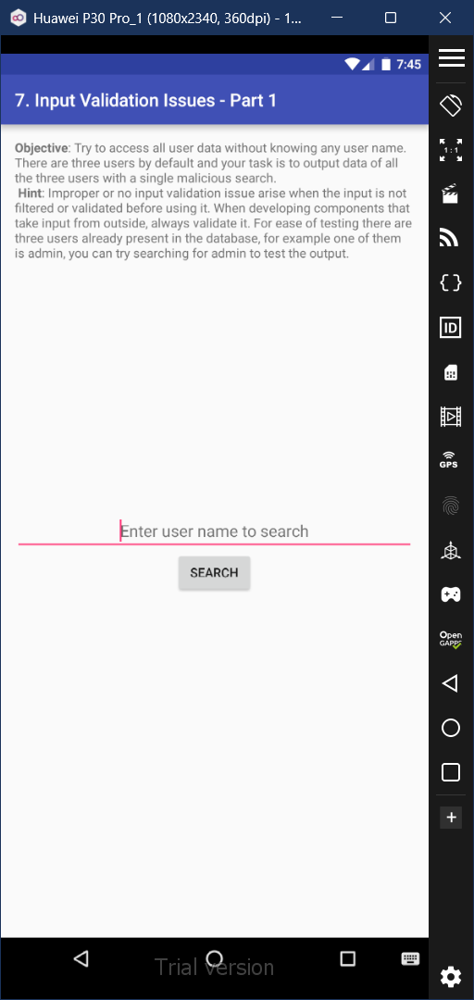
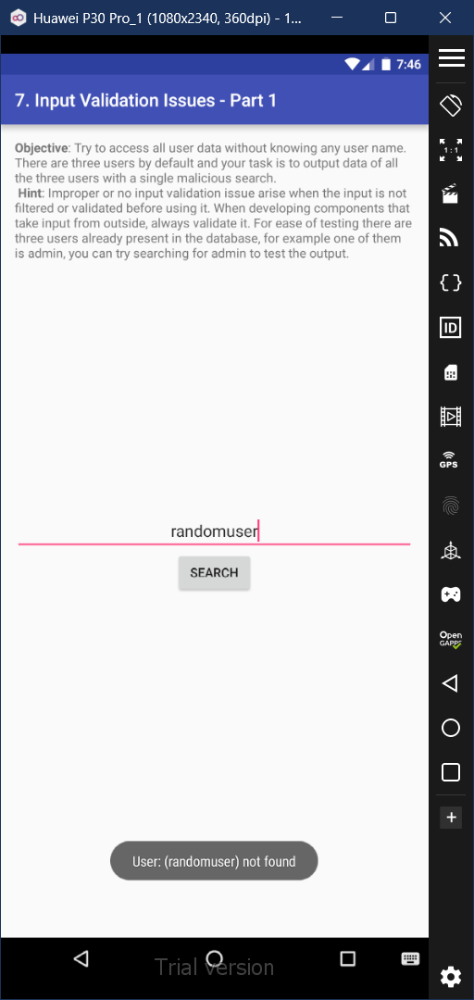
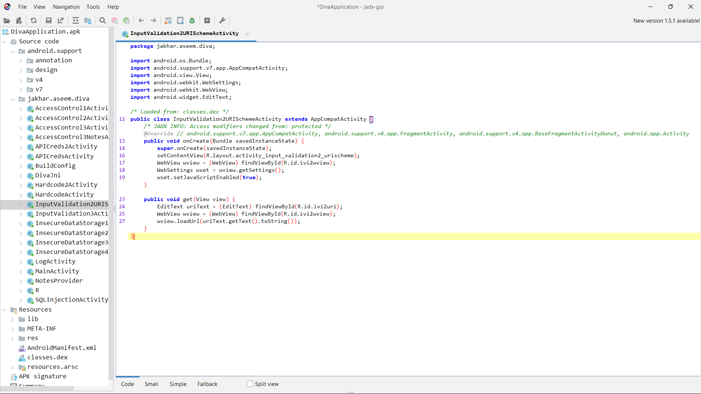
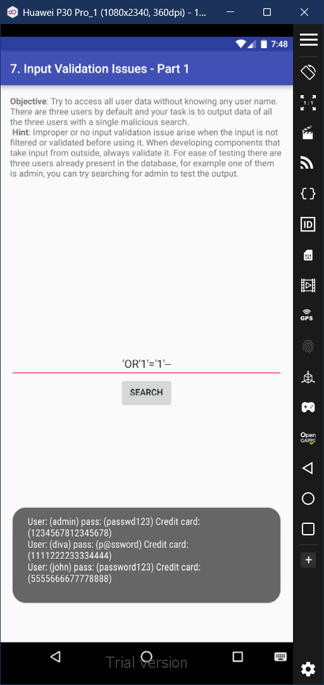

# 7. Input Validation Issues - Part 1

### Step 1: First simply attempt to search for a random user. You'll get a 'User: (randomuser) not found' prompt. This shows that if the condition is true, then the prompt will display all the details. 

### Step 2: If we view the underlying code of the activity, we'll observe that its vulnerable to SQL Injection. 

### Step 2: We now attempt to do an SQL Injection attack, and input injected code " 'OR'1'='1'-- " into the field. This injection successes, and a prompt appears with all the user details. 

