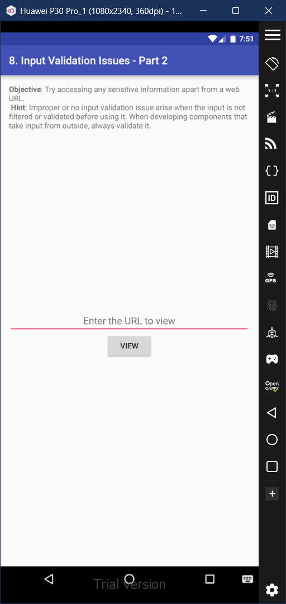
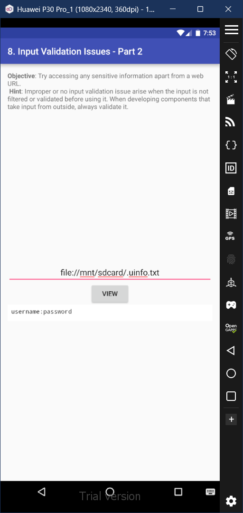

# 8. Input Validation Issues - Part 2

### Step 1: The URL in this activity was provided for web browsing. But we're going to attempt to attempt to access a file in the system instead. So we'll enter a known URL we obtained in the previous activity (Activity 6). After entrering this file path, we view that the contents of the file are printed out. 

