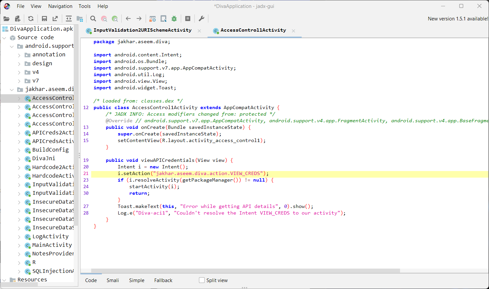
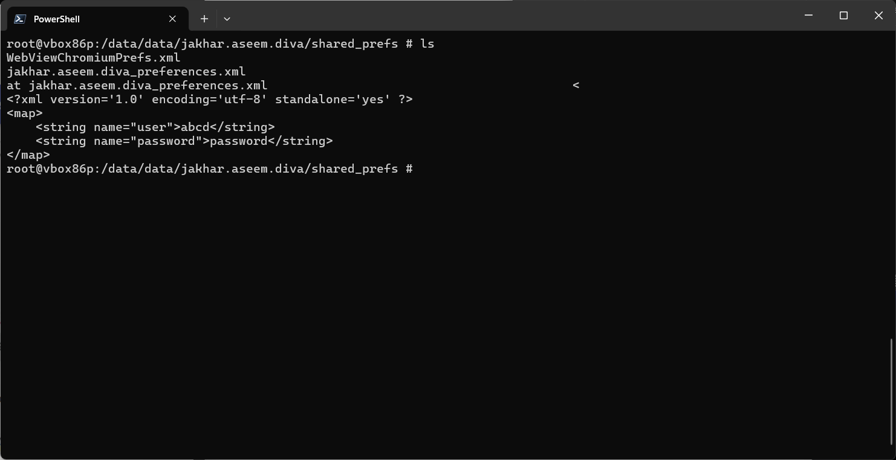
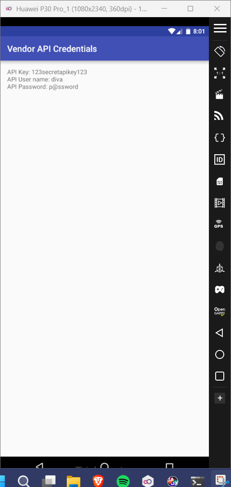

# 9. Access Control Issues - Part 1

### Step 1: When we view the code file of the activity, we'll notice that we can clearly view the action to be performed to access the API credentials. 

### Step 2: Open the root shell and enter the command to access the API 'am start -a jakhar.aseem.diva.action.VIEW_CREDS'. 

### Step 3: After executing the command, shell the DIVA app again and you'll see that now you can view the credentials. 

